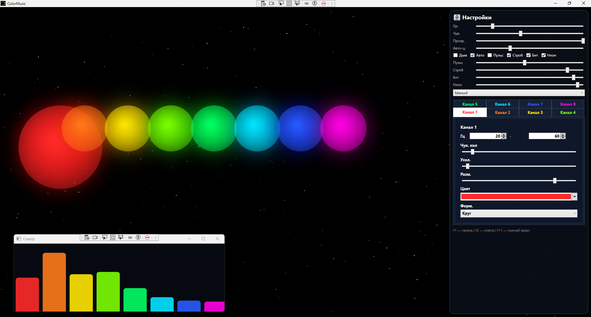

# ColorMusic

<p align="center">
  
</p>

<p align="center">
  <b>ColorMusic</b> — красивый WPF-визуализатор системного звука с 8 настраиваемыми цветными каналами, окном спектра и клубными эффектами.
</p>

<p align="center">
  <a href="../../releases/latest/download/ColorMusic.zip"></a>
  <a href="../../releases/latest"></a>
  <a href="#возможности"></a>
</p>

## Предпросмотр

> Положите изображение из репозитория в файл `docs/preview.png`.
> Для готового релиза используйте asset с именем `ColorMusic.zip`, тогда кнопка скачивания выше заработает без правок.

## Что умеет

- 8 независимых прожекторов по частотным диапазонам
- захват системного звука через loopback
- отдельные настройки для каждого канала:
  - диапазон частот
  - цвет
  - чувствительность
  - усиление
  - размер
  - форма
  - положение на экране
- окно спектра по 8 каналам
- сохранение настроек в `settings.json`
- полноэкранный режим
- фон со звёздным небом
- отключаемый дым
- эффекты с отдельными регуляторами:
  - автоуровень
  - пульсация
  - стробоскоп
  - вспышки по битам
  - неоновое свечение

## Скриншот


## Быстрый старт

### Требования

- Windows 10/11
- .NET 8 SDK
- устройство вывода звука, выбранное в Windows по умолчанию

### NuGet-пакеты

```bash
dotnet add package NAudio
dotnet add package MathNet.Numerics
dotnet add package Extended.Wpf.Toolkit
```

### Сборка

```bash
dotnet build
```

### Запуск

```bash
dotnet run
```

## Управление

- `F1` — показать или скрыть панель настроек
- `F2` — показать или скрыть окно спектра
- `F11` — полноэкранный режим

## Структура проекта

```text
ColorMusic/
├─ Audio/
│  ├─ AudioCapture.cs
│  └─ FftAnalyzer.cs
├─ Model/
│  ├─ AppSettings.cs
│  ├─ LightSettings.cs
│  ├─ LightShape.cs
│  └─ ReactionMode.cs
├─ Rendering/
│  ├─ DragController.cs
│  ├─ SmokeRenderer.cs
│  ├─ SpotlightControl.cs
│  └─ StarfieldRenderer.cs
├─ Storage/
│  └─ SettingsStorage.cs
├─ Assets/
│  └─ icon.ico
├─ docs/
│  └─ preview.png
├─ App.xaml
├─ App.xaml.cs
├─ MainWindow.xaml
├─ MainWindow.xaml.cs
├─ SpectrumWindow.xaml
├─ SpectrumWindow.xaml.cs
└─ settings.json
```

